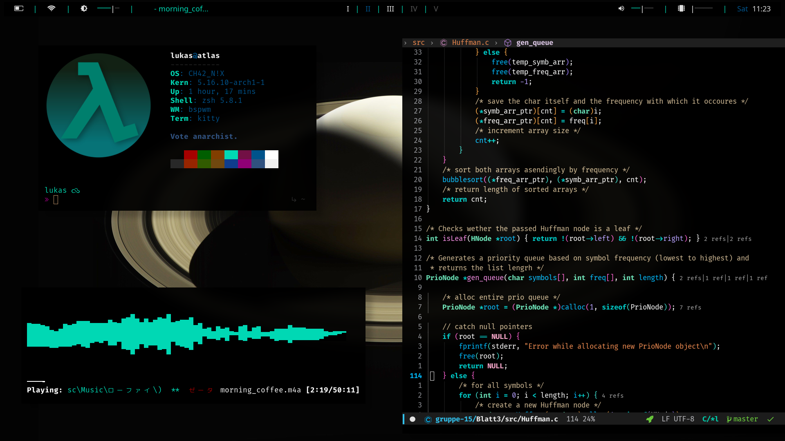
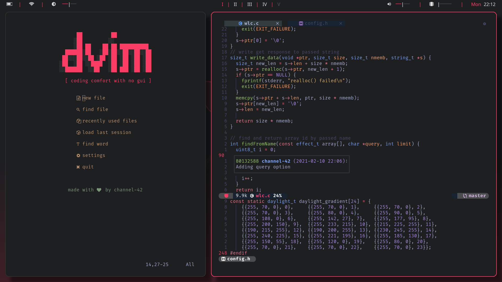
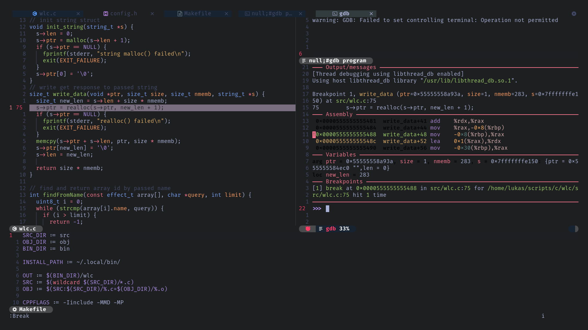
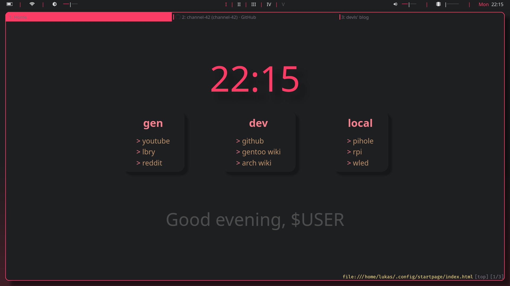
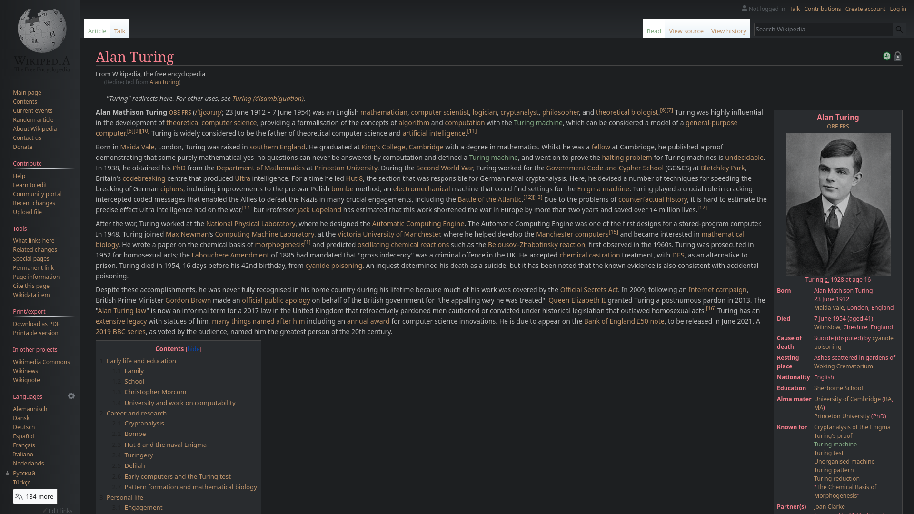

# channel-42's dotfiles    

These are the dotfiles of my arch-laptop. Should you have any question about this setup, you can reach out to me via mail (see my profile).

# contents
1. [about this setup](#about-this-setup)     
2. [themes](#themes)       
3. [nvim](#vim)       
4. [qutebrowser](#firefox)      

# about this setup

This is my main Arch laptop setup. The Arch desktop setup can be found in this repo as a separate branch. For my gentoo system, see [this](https://github.com/channel-42/gentoo) repo.

Here's a general overview of the software I use in this setup:

| Category | Name |
|:--------:|:----:|
|wm| bspwm (rounded corners fork)|
|bar|polybar|
|terminal|kitty|
|shell|zsh|
|compositor|picom (jonaburg fork)| 
|text editor|nvim|
|file browser|ranger|
|browser|qutebrowser|
|music player|ncmpcpp|
|pdf-viewer|zathura|
|launcher|rofi|

# Themes
I usually modify pre-made themes and colorschemes to fit my setup/taste.

| Programme | Theme Name | Modified? |
|:--------:|:----:|:-------:|
|Terminal/Xresources|custom|yes|
|nvim|[tokyo night](https://github.com/ghifarit53/tokyonight-vim)|no|

# nvim

I switched from vim to nvim a while ago. The vim configs are still present in this repo, but are not being updated.

The nvim configs are very similar to the one's of my gentoo setup. 

My nvim config includes the following:
- lsp-completion and -syntax-checking
- enhanced syntax highlighting provided by treesitter
- snippet support
- vim which key integration
- custom statusbar
- some visual enhancements 

>I have a [blog post](https://blog.devls.de/nvim-setup/nvim-setup.html) where I go over one of my older nvim setup. I'll update it when I have time.

# qutebrowser

I recently switched from Firefox to qutebrower. My config is not too crazy, I namely added a customized version of the apprentice colorscheme, which can be seen below.

